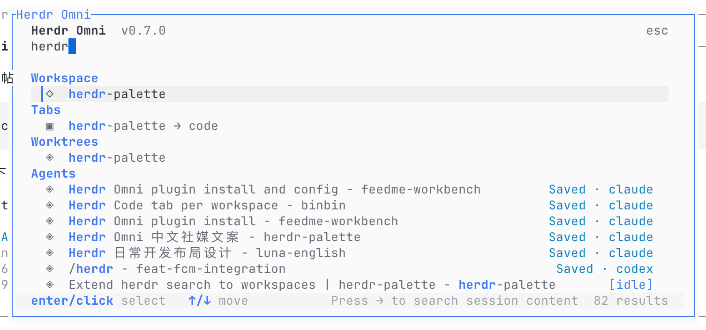
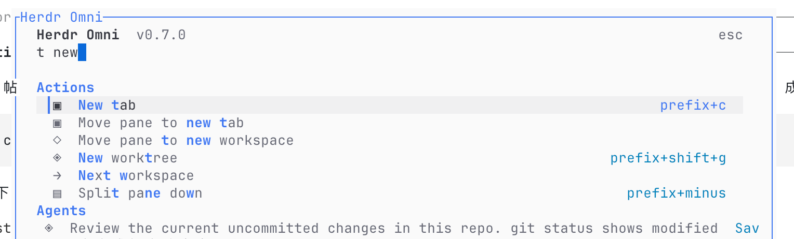
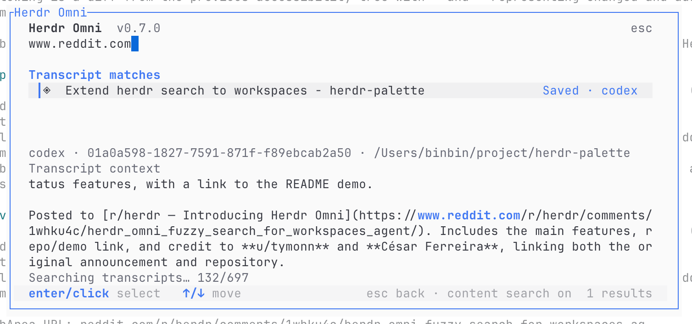

# Herdr Omni

**Less hunting. More building.**

Your [Herdr](https://herdr.dev) workspaces, tabs, worktrees, agent sessions, and
actions—one search away.



- **VS Code's actual fuzzy-matching core.** A few letters find the right result.
- **Find the conversation you remember.** Search live and saved Codex/Claude sessions—or press `→` to search their transcripts.
- **Recent when browsing. Relevance when searching.** History never overrides a better match.
- **Go straight there.** `@` workspaces · `>` agents · `:` actions.

Bind to **`cmd+p` on macOS** or **`ctrl+alt+p` on Linux** below.
Type, then press Enter or click a result.

Find actions with a few letters.



Remember the conversation, not its name? Press **→** to search session content.



Built with Bun and OpenTUI. Forked from
[Herdr Palette](https://github.com/cesarferreira/herdr-palette) by
[César Ferreira](https://github.com/cesarferreira).

## Install

**Supported platforms: macOS and Linux only. Windows is not currently supported.**

### Ask your agent to install

Copy this prompt into your coding agent:

```text
Please install and configure Herdr Omni for me:

1. Check the OS: Herdr Omni supports macOS and Linux only. If this is
   Windows or another unsupported OS, stop and explain that limitation.
   Check that Herdr and Bun are available. If Bun is missing, install it
   using the official instructions at https://bun.sh and make sure it is
   on the PATH available to Herdr.
2. Run `herdr plugin install mmjang/herdr-omni`.
3. Add the following binding to ~/.config/herdr/config.toml (the default).
   If HERDR_CONFIG_PATH is set, use that path instead; `herdr --help`
   shows the resolved config path. Preserve existing settings and avoid
   duplicates. Use key = "cmd+p" on macOS or key = "ctrl+alt+p" on Linux
   in the binding below. If that shortcut is already bound to another
   command, ask me how to resolve the conflict:

[[keys.command]]
key = "cmd+p"
type = "shell"
command = "\"$HERDR_BIN_PATH\" plugin pane open --plugin herdr-omni --entrypoint picker"
description = "Open Herdr Omni"

4. Run `herdr server reload-config`.
5. Confirm that `herdr plugin list` shows herdr-omni enabled and verify
   that its popup opens successfully.

Please execute these steps, troubleshoot any errors, and report the result.
```

### Manual install

Install [Herdr](https://herdr.dev) and [Bun](https://bun.sh), then run:

```sh
herdr plugin install mmjang/herdr-omni
```

Herdr downloads the plugin and runs its dependency installation. Follow the
prompts, then configure the shortcut under **Open the palette** below.
Use `herdr plugin list` to confirm that `herdr-omni` is installed and enabled.

#### Open the palette

Add this direct binding to `~/.config/herdr/config.toml`. If
`HERDR_CONFIG_PATH` is set, use that path instead. Run `herdr --help` to
check the resolved config path:

Use `cmd+p` on macOS, or change the `key` below to `ctrl+alt+p` on Linux.
If the shortcut is already assigned, choose an unused binding.

```toml
[[keys.command]]
key = "cmd+p"
type = "shell"
command = "\"$HERDR_BIN_PATH\" plugin pane open --plugin herdr-omni --entrypoint picker"
description = "Open Herdr Omni"
```

This uses Herdr's supported `shell` custom-command binding to call its
documented `plugin pane open` command. The `picker` pane is declared by this
plugin as a popup, so it opens without changing the tiled layout. Reload a
running configuration with:

```sh
herdr server reload-config
```

## Using Omni

Type to search, then **Enter** or click to jump. Use `@` for workspaces,
`>` for agents, or `:` for actions. Omni follows your Herdr theme and shortcuts;
UI-only actions show their keyboard binding.

Normal search includes saved session titles, projects, and IDs—no prefix needed.

To search local Codex/Claude transcripts, press **→** at the end of your query.
Matches arrive with context; **Esc** returns to normal search. Transcript search
uses literal words or quoted phrases, requires the corresponding CLI, and makes
no model requests.

Saved sessions resume in a new tab. If the original directory is gone, Omni
suggests a workspace for you to confirm. Conversation history is restored—not
deleted files or Git changes.

Official installs offer updates in-app; press **Ctrl+U** when a notice appears.
Reopen Omni after updating. Local checkouts and pinned installs are left alone.

## Local development

To work on the plugin source, clone the repository and link your checkout:

```sh
git clone https://github.com/mmjang/herdr-omni.git
cd herdr-omni
bun install
herdr plugin link .
herdr plugin list
```

If you already have a checkout, run the last three commands from its root.
Keep the checkout in place: Herdr runs the linked plugin from this directory.

## Release notes

### 0.7.0

- Find saved Codex and Claude sessions by title, project, or ID in normal search.
- Press **→** to search session content, with highlighted context and progressive results.
- Resume sessions in a matching workspace, or choose a suggested destination when the original directory is gone.
- See a waiting indicator while resuming, with duplicate launches prevented.

## Releasing

Add a short entry under **Release notes** first, then commit your changes.
Validate the project, bump the minor version, commit, tag, and push:

```sh
make release
```

Use `make release LEVEL=patch` or `LEVEL=major` for a different bump.

## Credits

Fuzzy matching uses Microsoft's [VS Code Quick Open scorer](https://github.com/microsoft/vscode/blob/6182a6ebe7cfcf1ce05126fcd475f66a5650cebc/src/vs/base/common/fuzzyScorer.ts).
See the [vendored source notes](src/vendor/vscode/README.md) and
[Microsoft MIT license](src/vendor/vscode/LICENSE.txt).

Herdr Omni is a fork of [Herdr Palette](https://github.com/cesarferreira/herdr-palette),
created by [César Ferreira (@cesarferreira)](https://github.com/cesarferreira).
Thank you for the original command palette, shortcut integration, and theme support
that this fork builds on.
