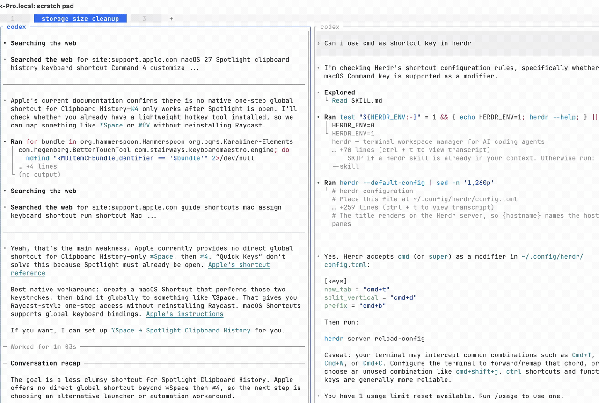

# Herdr Omni

**Less hunting. More building.**

Your [Herdr](https://herdr.dev) workspaces, tabs, worktrees, agent sessions, and
actions—one search away.



- **VS Code's actual fuzzy-matching core.** A few letters find the right result.
- **Find agent conversations by name.** See live status before you jump.
- **Recent when browsing. Relevance when searching.** History never overrides a better match.
- **Go straight there.** `@` workspaces · `>` agents · `:` actions.

Bind to **`cmd+p`** below. Type, then press Enter or click a result.

Built with Bun and OpenTUI. Forked from
[Herdr Palette](https://github.com/cesarferreira/herdr-palette) by
[César Ferreira](https://github.com/cesarferreira).

## Install

Install [Herdr](https://herdr.dev) and [Bun](https://bun.sh), then clone this
repository and link it as a local plugin:

```sh
git clone https://github.com/mmjang/herdr-omni.git
cd herdr-omni
bun install
herdr plugin link .
herdr plugin list
```

If you already have a checkout, run the last three commands from its root.
Keep the checkout in place: Herdr runs the linked plugin from this directory.
The local-link installation and popup command below have been verified with
Herdr 0.9.0 and Bun 1.3.14 on macOS.

## Open the palette

Add this direct binding to Herdr's `config.toml`:

```toml
[[keys.command]]
key = "cmd+p"
type = "shell"
command = "\"$HERDR_BIN_PATH\" plugin pane open --plugin herdr-omni --entrypoint picker"
description = "Open Herdr Omni"
```

This uses Herdr's supported `shell` custom-command binding to call its
documented `plugin pane open` command. The `picker` pane is declared by this
plugin as a popup, so it opens without changing the tiled layout. Reload a
running configuration with:

```sh
herdr server reload-config
```

## Release

Validate the project, bump the minor version, commit, tag, and push:

```sh
make release
```

Use `make release LEVEL=patch` or `LEVEL=major` for a different bump.

## Configuration and scope

The palette reads Herdr's `config.toml`, including `[keys]` remaps, custom
`[[keys.command]]` bindings, and `[theme]`, so it displays your effective
shortcuts and paints itself with your effective theme. Bindings keep the word
`prefix` instead of expanding it to the concrete leader key
(e.g. `prefix+z`, not `ctrl+a+z`). It stores recent selections locally
and never writes to your Herdr config.

### Theme

The popup follows Herdr's `[theme]` settings — `auto_switch`, `[theme.custom]`,
and the `[theme.custom.light]`/`[theme.custom.dark]` blocks — each time it
opens. No extra configuration is needed.

Only actions documented by Herdr and backed by its CLI/API run directly from the
palette, including rename, close, workspace/agent navigation, resize, swap, move
pane, worktree create/open/remove, and Edit scrollback (through Herdr's session
socket API). Edit scrollback targets the pane that opened Omni; the palette
closes after Herdr confirms the editor opened. Commands that need text (rename, open
worktree, remove confirmation) prompt inside the palette before running. Herdr's
UI-only commands — cycle/last pane, the shortcut guide, settings, copy mode, and
detach — are shortcut-only entries. In Herdr 0.9.0, native Copy mode is client-local
and has no plugin-callable API: close Omni with Esc, then use its displayed binding.
Sending keys to a pane would send them to the running application, not invoke
Herdr's Copy mode.
Custom commands from your configuration are shown as documentation only; their
execution semantics remain owned by Herdr. A failing Herdr command shows its
error and leaves the palette open.

The palette opens immediately with actions while live results load in the
background. Workspace, tab, and agent results appear before worktree discovery
finishes. Live results refresh automatically every two seconds after each
refresh completes; the selected item and search cursor are preserved, and failed
refreshes retain the last available results. Closing the palette stops polling.
Tab results include
their workspace as a breadcrumb, so repeated tab names remain unambiguous.
Unnamed tabs and tabs with purely numeric names are excluded from results.
Start a search with `>` to show only live agents; text after the prefix filters
those agent results further.
Use `@` for workspace-only search: `@` lists workspaces, while `@order`
fuzzy-searches them. Bare prefixes retain Recent; adding keywords ranks by relevance.
All Herdr commands appear under **Actions**. Start with `:` to show only actions,
or type a query such as `:split` to fuzzy-search them.

Search uses the actual VS Code Quick Open core scorer (vendored under MIT),
with Omni-specific field weighting, an exact-match bonus, Recent grouping, and
agent priorities. It does not reproduce VS Code's complete file-ranking policy.
Search fields are explicit: workspace and tab names, agent session/workspace
names and agent kinds, worktree names/branches, and curated action synonyms.
Paths support contiguous, case-insensitive text matching rather than scattered
fuzzy letters. Display descriptions, counts, statuses, internal IDs, automatic
index numbers, raw terminal titles, and shortcut modifiers are not search fields.
Recent appears only for an empty query or a bare `@` / `>` prefix, never for
keyword searches or Actions. Keyword searches keep results in their original
sections and rank by match quality, then agent attention priority; recency only
breaks remaining navigation ties. Action rankings never use history.
Each category appears once. Groups rank by their best match score, with ties
resolved by `CATEGORY_ORDER` in `src/constants.ts`; results within each group
retain their relevance ordering.
Search supports fuzzy abbreviations, with bonuses for consecutive letters and
word boundaries. Matching characters in result titles are highlighted using the
theme's accent color. Matching results selected successfully through the palette
are eligible for **Recent** only among the 10 most recently used available
navigation destinations, chosen before filtering by query or prefix. Up to 7
eligible candidates are shown while browsing, newest first. Older selections remain searchable
in their regular sections without duplicating the displayed Recent results.
These limits are configured by `RECENT_CANDIDATE_LIMIT` and `RECENT_DISPLAY_LIMIT`
in [`src/constants.ts`](src/constants.ts).
Recent contains navigation destinations only: workspaces, tabs, worktrees, and
agent sessions. Actions stay in **Actions** and do not occupy recent slots.
Remaining results are ordered by match quality and agent attention
priority (blocked, done, working, idle, unknown). Selection history survives
reopening the palette and is stored under `$XDG_STATE_HOME/herdr-palette`
(default `~/.local/state/herdr-palette`). Merely highlighting a row does not
record a visit.

The history directory retains its original name to preserve existing selections.

## Credits

Fuzzy matching uses Microsoft's [VS Code Quick Open scorer](https://github.com/microsoft/vscode/blob/6182a6ebe7cfcf1ce05126fcd475f66a5650cebc/src/vs/base/common/fuzzyScorer.ts).
See the [vendored source notes](src/vendor/vscode/README.md) and
[Microsoft MIT license](src/vendor/vscode/LICENSE.txt).

Herdr Omni is a fork of [Herdr Palette](https://github.com/cesarferreira/herdr-palette),
created by [César Ferreira (@cesarferreira)](https://github.com/cesarferreira).
Thank you for the original command palette, shortcut integration, and theme support
that this fork builds on.
